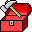

<h1> Hey! Nice to see you.</h1>

Welcome to my page!   I'm Imdadurahman, a passionate self-learned full-stack developer from  <b>Kerala, India.</b> My personal interests are mathematics, problem-solving, and coding.

<h3>My Working Stack — So Far!</h3>

 
<b>Coding:</b> 

 

<b>Other:</b> 

<h3>Where to find me</h3>

</a> </a> </a> </a>

---
